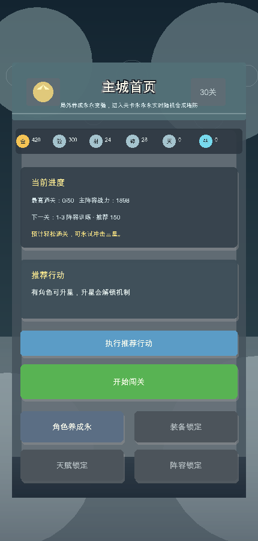
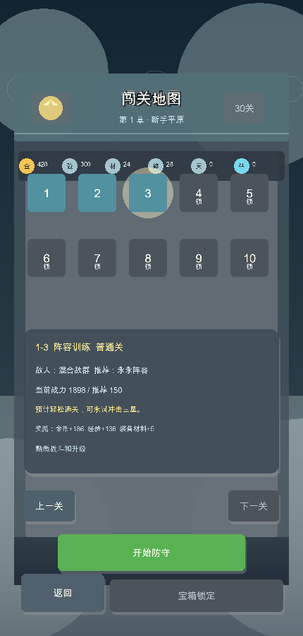
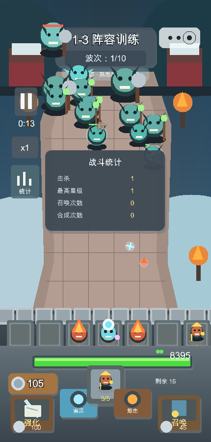
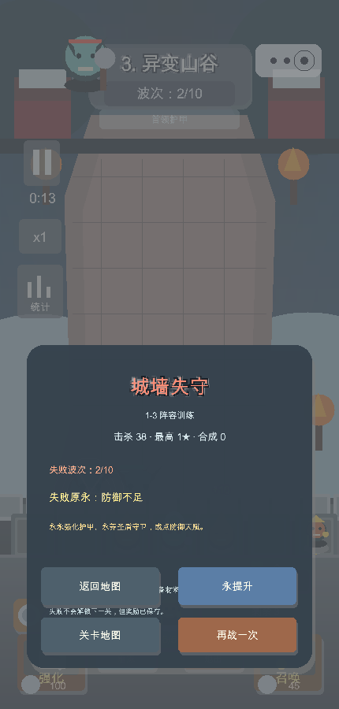

# Blue Planet Defense

`Blue Planet Defense` 是一个 C++17 + raylib 5.5 的竖屏塔防原型。当前版本采用“局外养成推进 + 局内实时随机合成塔防”的结构：玩家在主城培养角色、装备、天赋和阵容，进入关卡后游玩实时随机召唤、2 合 1、拖拽合成、三选一强化和怪物推进守城玩法。

这个仓库不是纯 UI Demo，所有主要按钮都有实际效果，资源、星级、关卡解锁、宝箱、阵容、角色养成、装备养成和天赋养成都会写入本地存档。

## Gameplay Loop

```text
主城查看目标
  -> 选择关卡
  -> 局内实时塔防
  -> 胜利/失败结算
  -> 获得资源
  -> 角色/装备/天赋/阵容养成
  -> 战力提升
  -> 推进更高关卡或回头补星
```

## Features

- 局外主城：首页显示资源、主阵容战力、下一关、推荐战力、挑战预估和推荐行动。
- 5 章 50 关：普通关、精英关、Boss 关，支持锁定/解锁、星级保存、推荐阵容和奖励预览。
- 局内实时战斗：7 个英雄槽位、随机召唤、召唤 5 次随机扩展相邻战位、点击/拖拽 2 合 1、最高 5 星、10 波怪物、城墙血条。
- 局内随机成长：三选一强化、召唤进度记录、速度切换和统计面板。
- 30 个局内英雄：强袭、剑仙、钢铁汪、火箭、蘑菇头、游侠、小炮、孙悟空、哪吒、赵云、剑圣、骑士、卡卡、帝斯拉、暴风、闪电之子、雪姬、火焰法师、毒液、黑百合、河掌柜、死亡骑士、海王、安妮、妲己、天使、美人鱼、雅典娜、冰法师、地鼠。
- 6 个局外角色：火焰法师、冰霜弓手、圣盾守卫、雷电术士、狂战士、自然祭司。升级和升星会提升战力，并映射到局内初始英雄与战斗加成。
- 4 个装备槽：武器、护甲、饰品、宝物。强化后真实影响局内伤害、城墙生命、攻速、Boss 伤害和流派加成。
- 4 条天赋分支：攻击、防御、资源、职业，每条 5 个节点，有前置关系和关键节点。
- 章节星级宝箱：每章 10/20/30 星奖励，领取状态会保存，不能重复领取。
- 结算系统：胜利给普通奖励、首通奖励、星级和解锁；失败给安慰奖励和明确提升建议。
- 本地存档：`save.dat` 保存资源、关卡解锁、星级、宝箱、角色等级/星级、阵容、装备和天赋。

## Screenshots

| 主城 | 关卡地图 |
| --- | --- |
|  |  |

| 局内实时战斗 | 结算 |
| --- | --- |
|  |  |

## Build

Requirements:

- CMake 3.24+
- C++17 compiler
- Git access for CMake `FetchContent`, because raylib 5.5 is fetched during configure.

```bash
cmake -S . -B build
cmake --build build -j4
./build/blue_planet_defense
```

## Verify

```bash
./build/blue_planet_defense --verify
```

The verification command checks:

- 30 个局内英雄和局内战斗关卡数据。
- 5 章 50 关、6 个局外角色、4 个装备槽、20 个天赋节点。
- 启动进入局外主城。
- 局内玩法：10 波、随机召唤、5 次召唤扩展相邻战位、点击合成、拖拽合成、随机强化、怪物递增。
- 30 英雄技能和攻击/命中特效逻辑。
- 新局外养成：角色升级、角色升星、装备强化、天赋升级、胜利资源与星级结算、失败安慰奖励和失败原因。

## Screenshot Commands

```bash
./build/blue_planet_defense --screenshot city screenshots/city-hybrid.png
./build/blue_planet_defense --screenshot stage screenshots/map-hybrid.png
./build/blue_planet_defense --screenshot heroes screenshots/heroes-hybrid.png
./build/blue_planet_defense --screenshot equipment screenshots/equipment-hybrid.png
./build/blue_planet_defense --screenshot talents screenshots/talents-hybrid.png
./build/blue_planet_defense --screenshot lineup screenshots/lineup-hybrid.png
./build/blue_planet_defense --screenshot battle screenshots/battle-hybrid.png
./build/blue_planet_defense --screenshot result screenshots/result-hybrid.png
```

## Controls

- 主城：点击“开始闯关”进入地图；点击角色、装备、天赋、阵容进入对应养成页。
- 地图：点击关卡节点选择关卡，点击“开始防守”进入局内实时战斗。
- 局内：点击“召唤”消耗银币召唤英雄。
- 合成：点击两个相同英雄同星级槽位，或拖拽到另一个同英雄同星级槽位。
- 强化：点击“强化”打开三选一随机成长。
- 召唤进度：中间记录显示 `x/5`，每召唤 5 次清零，并随机解锁一个连接到已有战位的相邻召唤位置。
- 结算：胜利可去下一关、回地图或去养成；失败可再战、回地图或跳转推荐养成。

## Asset Replacement

英雄图片路径已经预留。后续给某个局内英雄换图时，按 `spriteKey` 放入两帧 PNG：

```text
assets/sprites/<hero spriteKey>_0.png
assets/sprites/<hero spriteKey>_1.png
```

如果某个英雄暂时没有专属 PNG，游戏会自动使用程序绘制的 fallback 形象，不会空白。命中特效通过 `AttackStyle` / `ImpactKind` 配置，当前包含箭矢、冰晶、斩击、毒雾、炸弹、圣光、激光、闪电、火焰、风场、召唤冲击、魅惑波。

## Project Structure

```text
src/main.cpp          程序入口和命令行参数
src/game.hpp          Game 对外接口
src/game.cpp          状态机、旧局内战斗、新局外 UI、存档、验证
src/game_types.hpp    通用类型、枚举、存档结构
src/game_content.hpp  旧局内 30 英雄、局内关卡和支援兼容数据
src/meta_content.hpp  新局外 6 角色、50 关、装备、天赋数据
assets/audio/         WAV 音效
assets/sprites/       场景、英雄、怪物 PNG
```

## Local Files Not Committed

- `build/`
- `save.dat`
- `.DS_Store`
- `outputs/`
