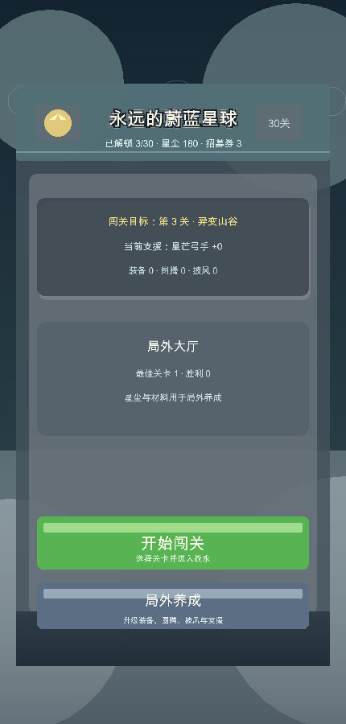
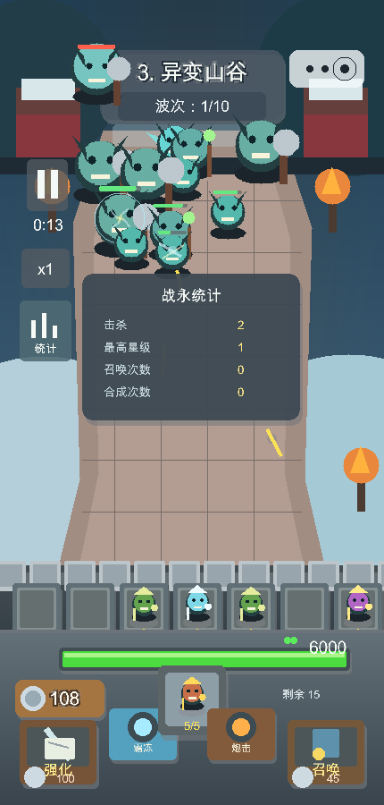
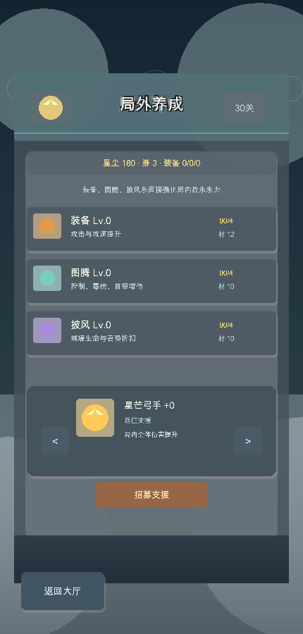

# Blue Planet Defense

一个使用 C++17 + raylib 5.5 制作的竖屏随机合成塔防原型，玩法参考《永远的蔚蓝星球》的“英雄随机召唤、2 合 1、局内随机强化、局外养成”循环。工程不是 pygame，也不是网页 JS；它可以通过 CMake 编译成本机可执行程序。





## 当前内容

- 竖屏 430x900 战斗界面，包含雪地峡谷战场、城墙、英雄槽、怪物推进、血条和底部操作区。
- 完整局外大厅流程：启动进入大厅，可进入关卡选择或局外养成；只有点击“开始防守”才进入局内战斗。
- 30 个递增关卡，每关有词条、怪物生命/速度/护甲倍率、怪物密度、材料奖励和装备掉率。
- 10 波战斗，前 9 波随机怪群，第 10 波 Boss。
- 随机召唤、点击合成、拖拽合成、最高 5 星。
- 局内三选一强化，包含伤害、攻速、控制、毒伤、Boss 增伤、城墙修复、召唤折扣、机关冷却、范围增强。
- 机关技能：霜冻、炮击、王者号令。
- 本地存档 `save.dat`：保存已解锁关卡、星尘、材料、装备掉落、支援人物、装备/图腾/披风等级、最佳关卡和胜利次数。
- 局外养成：装备、图腾、披风升级；装备影响攻击/攻速，图腾影响控制/毒伤/Boss 增伤，披风影响城墙生命/回复/召唤折扣。
- 支援抽卡：支援人物提供伤害、攻速、控制、城防或资源 Buff。
- WAV 音效：召唤、合成、射击、命中、霜冻、炮击、强化、胜利、失败。

## 30 英雄体系

已录入 30 个英雄：强袭、剑仙、钢铁汪、火箭、蘑菇头、游侠、小炮、孙悟空、哪吒、赵云、剑圣、骑士、卡卡、帝斯拉、暴风、闪电之子、雪姬、火焰法师、毒液、黑百合、河掌柜、死亡骑士、海王、安妮、妲己、天使、美人鱼、雅典娜、冰法师、地鼠。

每个英雄在 `src/game_content.hpp` 中拥有：

- `name` / `job`
- `spriteKey`
- 主色、点缀色、弹道色
- `AttackStyle`
- `HeroSkill`
- 基础伤害、冷却、射程、范围

每个英雄也有局内技能逻辑，覆盖连射/穿透、Boss 增伤、炸弹、中毒、灼烧、突刺、连斩、冰冻、闪电链、龙卷、召唤承伤、魅惑反推、攻速辅助、易伤等方向。

## 资源替换路径

英雄图片路径已经预留。后续给某个英雄换图时，只需要按 `spriteKey` 放入两帧 PNG：

```text
assets/sprites/<hero spriteKey>_0.png
assets/sprites/<hero spriteKey>_1.png
```

例如：

```text
assets/sprites/hero_assault_0.png
assets/sprites/hero_assault_1.png
assets/sprites/hero_wukong_0.png
assets/sprites/hero_wukong_1.png
```

如果某个英雄暂时没有专属 PNG，游戏会自动使用程序绘制的 fallback 形象，不会空白。命中特效路径也已经通过 `AttackStyle` / `ImpactKind` 预留，当前包含箭矢、冰晶、斩击、毒雾、炸弹、圣光、激光、闪电、火焰、风场、召唤冲击、魅惑波。

## 构建运行

需要 CMake 3.24+ 和 C++17 编译器。第一次配置会通过 CMake FetchContent 下载 raylib 5.5。

```bash
cmake -S . -B build
cmake --build build -j4
./build/blue_planet_defense
```

macOS 上如果窗口无法打开，请确认已安装 Xcode Command Line Tools：

```bash
xcode-select --install
```

## 自检

```bash
./build/blue_planet_defense --verify
```

自检覆盖：

- 30 关数据。
- 30 类英雄数据、数值和资源 key。
- 英雄贴图槽位与英雄目录一致，便于后续替换资源。
- 30 个英雄逐个命中测试，确保每个英雄都有伤害或有效战斗效果。
- WAV 音效加载。
- 存档数据。
- 10 波配置、召唤、点击合成、拖拽合成、随机强化。
- 怪物数量递增、首波压力、后期血量和密度。
- 霜冻、炮击、王者号令。
- 局外装备养成、支援 Buff、支援抽卡、胜利掉落。
- 模拟循环稳定性。

## 生成截图

```bash
./build/blue_planet_defense --screenshot start screenshots/lobby.png
./build/blue_planet_defense --screenshot stage screenshots/stage-select.png
./build/blue_planet_defense --screenshot meta screenshots/meta-upgrade.png
./build/blue_planet_defense --screenshot battle screenshots/battle-30-heroes.png
./build/blue_planet_defense --screenshot draft screenshots/draft-optimized.png
```

## 操作

- 大厅：点击“开始闯关”进入关卡选择，点击“局外养成”进入养成页。
- 关卡选择：左右箭头切换已解锁关卡，点击“开始防守”进入战斗。
- 局外养成：点击装备、图腾、披风升级；点击支援左右箭头切换已拥有支援，点击“招募支援”抽卡。
- 局内：点击“召唤”消耗银币召唤英雄。
- 合成：点击两个相同英雄同星级槽位，或直接拖拽到目标槽位，进行 2 合 1。
- 强化：点击“强化”打开三选一。
- 机关：点击“霜冻”“炮击”“王者号令”使用主动能力。
- 速度/统计：点击左侧 `x1` 切换速度，点击“统计”查看战斗统计。

## 工程结构

```text
.
├── CMakeLists.txt
├── assets/
│   ├── audio/          # WAV 音效
│   └── sprites/        # 场景、英雄、怪物 PNG
├── screenshots/        # 示例截图
├── src/
│   ├── main.cpp        # 程序入口和命令行参数
│   ├── game.hpp        # Game 对外接口
│   ├── game.cpp        # 状态机、战斗、UI、存档、验证
│   ├── game_types.hpp  # 通用类型、枚举、数据结构
│   └── game_content.hpp# 英雄、支援、关卡数据表
└── tools/
    └── generate_assets.py
```

## 不提交的本地文件

- `build/`
- `save.dat`
- `.DS_Store`
- `outputs/`

这些文件由本机运行或构建生成，不需要进入仓库。
